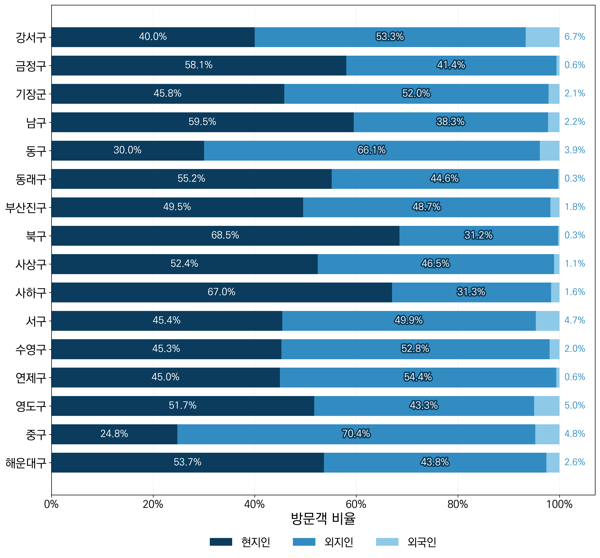

# 리뷰산 — 부산 관광취약지역 분석

부산광역시 16개 구·군의 **방문객, 관광소비액, 관광자원, 대중교통 인프라**를 비교하여 지역별 관광 현황과 격차를 살펴보는 데이터 분석 프로젝트입니다. 공공데이터 수집 코드, 전처리·분석용 Jupyter Notebook, 시각화 결과와 발표 자료를 담고 있습니다.

📄 [발표 자료: 리뷰산_관광취약지역.pdf](리뷰산_관광취약지역.pdf)

## 분석 목적과 범위

- 구·군별 관광객 규모와 현지인·외지인·외국인 구성 비교
- 2021~2025년 방문자 수 및 내·외국인 관광소비액 변화 분석
- 관광지 수와 버스 노선·정류소·지하철역 분포 비교
- 방문객 수와 관광소비액을 함께 살펴 관광취약지역 검토에 활용

권역별 시각화에서는 다음과 같은 **프로젝트 내 분류**를 사용합니다.

| 권역 | 구·군 |
| --- | --- |
| 원도심 | 중구, 동구, 서구, 영도구 |
| 중부산 | 남구, 부산진구, 수영구, 연제구 |
| 서부산 | 강서구, 북구, 사상구, 사하구 |
| 동부산 | 금정구, 기장군, 동래구, 해운대구 |

## 주요 분석

| 분석 항목 | 내용 | 관련 노트북 (`mini_project/scripts/`) |
| --- | --- | --- |
| 대중교통 인프라 | 구·군별 버스 노선 수, 정류소 수, 지하철역 수 비교 및 지도 시각화 | `00_대중교통인프라.ipynb` |
| 관광자원 분포 | 구·군별 관광지 개수를 행정구역 지도에 표시 | `01_관광지수지도.ipynb` |
| 방문객 현황 | 2025년 방문객 유형·구성비 및 연도별 외국인 방문 추이 | `02_구군별_방문객.ipynb` |
| 관광소비액 | 2021~2025년 구·군별 내·외국인 관광소비액 비교 | `03_관광소비액.ipynb` |
| 방문·소비 통합 비교 | 2025년 방문객 수와 소비금액을 로그 스케일 산점도 및 평균선으로 비교 | `04_구군별_관광소비액_방문객.ipynb` |

`-수정.ipynb` 파일에는 교통 인프라, 방문객, 관광소비액을 권역별로 구분한 시각화가 포함되어 있습니다. 파일명의 `관광지수`는 **관광지의 개수**를 뜻합니다.

## 시각화 미리보기

### 부산 구·군별 관광지 수


### 대중교통 인프라


### 2025년 방문객 구성비



추가 결과는 [시각화 폴더](시각화/__/시각화/)에서 확인할 수 있습니다. 외국인 방문객 시계열, 방문객 유형별 비교, 내·외국인 관광소비액 그래프 등이 포함되어 있습니다.

## 폴더 구성

```text
reviewbusan/
├── README.md
├── 리뷰산_관광취약지역.pdf               # 발표 자료
├── mini_project/
│   └── scripts/                        # 데이터 수집·분석 노트북 및 수정본
└── 시각화/
    └── __/
        ├── *.csv                       # 수집 데이터
        ├── *.docx, *.zip                # API 활용 가이드 등
        ├── sigungu/                    # 행정구역 경계: shp, shx, dbf
        └── 시각화/
            ├── 00_대중교통인프라.ipynb
            ├── 01_관광지수지도.ipynb
            ├── 02_구군별_방문객.ipynb
            ├── 03_관광소비액.ipynb
            ├── *.csv, *.xlsx           # 분석용 집계 데이터
            ├── *.png                   # 시각화 결과
            └── font/                   # KoPubWorld 한글 폰트
```

## 데이터

아래는 저장소의 파일명과 수집 노트북을 기준으로 정리한 자료입니다.

| 구분 | 자료 | 저장 위치 |
| --- | --- | --- |
| 관광객 | 한국관광공사 지역별 방문자 수, 방한 외래관광객 국적별·성별 집계 | `시각화/__/`의 CSV |
| 관광정보 | 한국관광공사 국문 관광정보 서비스의 지역기반 관광정보 | `시각화/__/`의 CSV |
| 맛집 | 부산광역시 부산맛집정보 서비스 | `시각화/__/`의 CSV |
| 버스 | 부산광역시 부산버스정보시스템 노선·정류소 정보 | `시각화/__/노선정보.csv`, `정류소정보.csv` |
| 지하철 | 국가철도공단 부산 지하철 주소 데이터 및 위·경도 추가 자료 | `시각화/__/`의 해당 CSV |
| 방문자 집계 | 부산 구·군별 연도별 방문자 수(2021~2025) | `시각화/__/시각화/부산_구군별_연도별_방문자수_2021_2025_final.xlsx` |
| 소비액 집계 | 내·외국인 총관광소비 데이터 | `시각화/__/시각화/내외국인 총관광소비 데이터.xlsx` |
| 인프라 집계 | 구·군별 교통 접근성, 관광지 수 | `시각화/__/시각화/`의 해당 CSV |
| 공간정보 | 시·군·구 행정구역 경계 | `시각화/__/sigungu/sig.shp` |

수집 노트북에는 행정안전부 법정동코드를 조회하여 지역을 구분하는 과정도 포함되어 있습니다. 연도별 분석 자료와 API 수집 자료는 조회 기간이 다를 수 있으므로, 비교 시 각 파일의 기간·단위·집계 기준을 확인해야 합니다.

## 실행 방법

### 1. Python 환경과 패키지 준비

Python 3 환경에서 다음 패키지를 설치합니다. 아래 목록은 노트북의 import와 CSV·Excel·공간정보 사용을 기준으로 정리했으며, 별도의 버전 고정 파일은 제공하지 않습니다.

```bash
python -m pip install jupyterlab pandas numpy matplotlib geopandas contextily openpyxl requests python-dotenv tqdm watermark
```

### 2. 제공된 데이터로 시각화 실행

저장소 루트에서 다음 명령으로 실행합니다.

```bash
cd "시각화/__/시각화"
python -m jupyterlab
```

이 폴더의 `00_대중교통인프라.ipynb`부터 `03_관광소비액.ipynb`까지 원하는 노트북을 열고 셀을 위에서부터 실행합니다. 각 노트북은 해당 폴더의 집계 데이터를 읽으므로 API 재수집 없이 분석할 수 있습니다.

**실행 전 한글 폰트 경로를 변경해야 합니다.** 기존 코드의 `/home/DL/.local/share/fonts/KoPubWorld/KoPubWorld Dotum Medium.ttf`를 제공된 폰트의 상대 경로로 바꿉니다.

```python
font_path = "font/KoPubWorld Dotum Medium.ttf"
```

지도 노트북은 `../sigungu/sig.shp`를 참조합니다. 같은 폴더의 `.shx`, `.dbf` 파일도 함께 유지해야 합니다. 배경지도 타일을 불러오는 셀은 인터넷 연결이 필요합니다.

`mini_project/scripts/`의 수정본이나 방문·소비 통합 분석을 실행할 때는 CSV·Excel·폰트·행정구역 파일의 경로를 실제 데이터 위치에 맞게 조정해야 합니다. 또는 해당 노트북을 위 시각화 폴더에 복사한 뒤 폰트 경로를 수정하여 실행할 수 있습니다.

### 3. API 데이터 재수집이 필요한 경우

수집 코드는 `mini_project/scripts/`에 있습니다.

- `00_시군구지역방문자수.ipynb`: 지역별 방문자 수 수집
- `01_관광지정보.ipynb`: 지역기반 관광정보 수집
- `02_맛집정보.ipynb`: 부산 맛집정보 수집
- `03_버스정보.ipynb`: 버스 정류소·노선 수집 및 행정구역 매칭
- `04_관광객수.ipynb`: 외래관광객 집계 및 관광 다양성 데이터 탐색

수집 코드는 `load_dotenv()`와 `os.getenv("API_KEY")`를 사용합니다. 사용하는 공공데이터 API의 활용 신청과 키 발급 후, 노트북에서 읽을 수 있는 위치의 `.env`에 다음과 같이 설정합니다.

```dotenv
API_KEY=발급받은_API_키
```

API 키와 `.env`는 저장소에 커밋하지 않습니다. 요청 기간, 지역코드, 응답 형식, 저장 경로는 각 노트북에서 확인하고 설정합니다. 버스 수집 코드의 `sigungu/sig.shp` 경로도 작업 위치에 맞게 변경해야 합니다.

## 해석 및 재현 시 참고사항

- 노트북의 지표 비교와 평균선은 탐색적 분석입니다. 이를 공식 관광취약지역 지정 기준이나 인과관계로 해석하지 않습니다.
- 방문자 수는 원자료의 집계 기준을 따릅니다. 구·군별 합계를 중복 없는 부산 전체 방문 인원으로 간주하지 않습니다.
- 관광 다양성 관련 수집 셀에는 `부적합`, 연관 관광지 관련 부분에는 `미진행` 표시가 있습니다. 모든 수집 시도가 최종 분석에 사용된 것은 아닙니다.
- `05_관광자원1.ipynb`에는 외래관광객·관광 다양성 조회 코드가 포함되어 있으므로, 파일명만으로 분석 내용을 판단하지 않습니다.
- 노트북에는 기존 실행 결과가 포함되어 있지만, 환경별 전체 재실행을 보장하는 자동화 구성은 없습니다. 데이터 인코딩, 파일 경로, 한글 폰트 및 패키지 호환성을 확인한 뒤 실행합니다.
